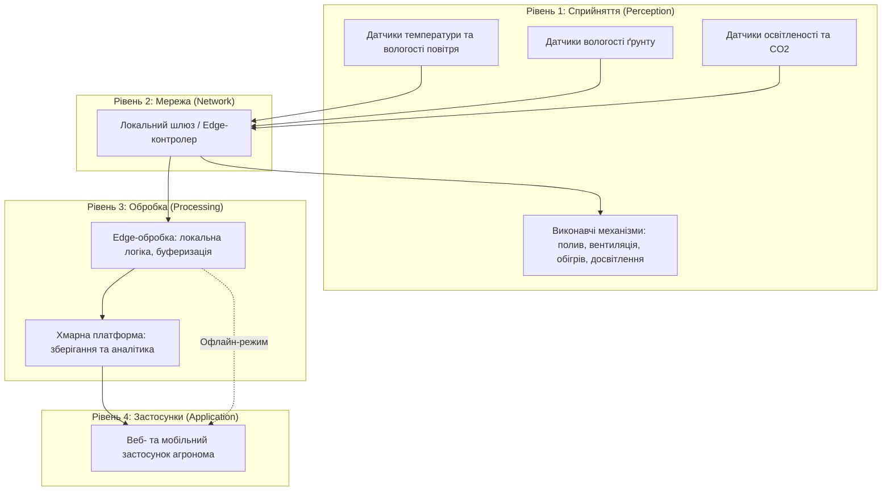

# Практична робота 1: Вступ до IoT та SMART-технологій

## Варіант 1: Розумна теплиця (площа 200 м²)

---

## 1. Архітектура системи (Чотирирівнева модель)

---

## 2. Таблиця складу системи

| Рівень системи | Компонент / Пристрій | Призначення | Місце розміщення |
| :--- | :--- | :--- | :--- |
| **Сприйняття** | Датчики DHT22 / SHT31 | Вимірювання температури та вологості повітря | По периметру теплиці (на кожні 50 м²) |
| **Сприйняття** | Ємнісні датчики вологості ґрунту | Контроль вологості в кореневій зоні | У ґрунті на різній глибині |
| **Сприйняття** | Люксметри / ФАР-сенсори + датчики CO2 | Вимірювання рівня освітленості та концентрації вуглекислого газу | У зоні росту рослин |
| **Сприйняття** | Електромагнітні клапани, насоси | Керування системою крапельного поливу | У вузлах подачі води |
| **Сприйняття** | Реверсивні вентилятори, приводи кватирок | Вентиляція та регулювання мікроклімату | На стінах та даху теплиці |
| **Сприйняття** | LED-фітолампи, інфрачервоні обігрівачі | Досвітлення та обігрів теплиці | Над рослинами / по периметру |
| **Мережа** | Zigbee-координатор та Wi-Fi роутер | Передача даних від датчиків до шлюзу | Центральна частина теплиці |
| **Обробка** | Промисловий Edge-контролер (на базі Raspberry Pi / ESP32) | Первинна обробка, локальна логіка, керування без хмари | Технічне приміщення теплиці |
| **Обробка / Застосунки** | Хмарний сервер (AWS / Azure / Local Server) | Зберігання архівних даних, звітність, дашборди | Віддалений дата-центр |

---
