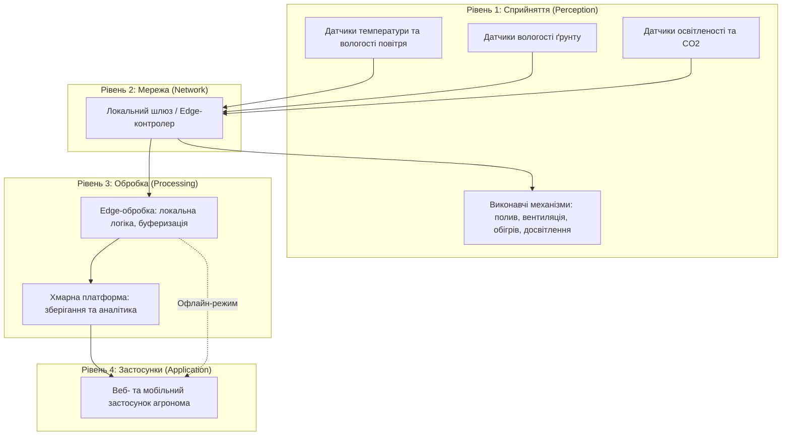

# Практична робота 1: Вступ до IoT та SMART-технологій

## Варіант 1: Розумна теплиця (площа 200 м²)

---

## 1. Архітектура системи (Чотирирівнева модель)

---

## 2. Таблиця складу системи

| Рівень системи | Компонент / Пристрій | Призначення | Місце розміщення |
| :--- | :--- | :--- | :--- |
| **Сприйняття** | Датчики DHT22 / SHT31 | Вимірювання температури та вологості повітря | По периметру теплиці (на кожні 50 м²) |
| **Сприйняття** | Ємнісні датчики вологості ґрунту | Контроль вологості в кореневій зоні | У ґрунті на різній глибині |
| **Сприйняття** | Люксметри / ФАР-сенсори + датчики CO2 | Вимірювання рівня освітленості та концентрації вуглекислого газу | У зоні росту рослин |
| **Сприйняття** | Електромагнітні клапани, насоси | Керування системою крапельного поливу | У вузлах подачі води |
| **Сприйняття** | Реверсивні вентилятори, приводи кватирок | Вентиляція та регулювання мікроклімату | На стінах та даху теплиці |
| **Сприйняття** | LED-фітолампи, інфрачервоні обігрівачі | Досвітлення та обігрів теплиці | Над рослинами / по периметру |
| **Мережа** | Zigbee-координатор та Wi-Fi роутер | Передача даних від датчиків до шлюзу | Центральна частина теплиці |
| **Обробка** | Промисловий Edge-контролер (на базі Raspberry Pi / ESP32) | Первинна обробка, локальна логіка, керування без хмари | Технічне приміщення теплиці |
| **Обробка / Застосунки** | Хмарний сервер (AWS / Azure / Local Server) | Зберігання архівних даних, звітність, дашборди | Віддалений дата-центр |

---

## 3. Обґрунтування розміщення обробки (Edge / Cloud)

* **Edge (Локальна обробка):** Використовується для критичних завдань керування мікрокліматом (полив, аварійна вентиляція, обігрів). **Вимога до затримки:** критично низька (< 50–100 мс), оскільки затримка в прийнятті рішень може призвести до пошкодження врожаю при різких перепадах температури чи відсутності поливу.
* **Хмара (Cloud):** Використовується для довгострокового зберігання історії телеметрії, побудови трендів, аналітики врожайності та віддаленого доступу агронома. **Вимога до затримки:** некритична (секунди або хвилини), оскільки архівні дані та аналітика не потребують миттєвої реакції.

---

## 4. Сценарій на випадок втрати зв'язку з хмарою

Система спроєктована за принципом **Edge-first**:
1. **Автономне прийняття рішень:** Локальний Edge-контролер виконує завантажені правила та ПІД-алгоритми безпосередньо в теплиці. Усі порогові значення температур, вологості та рівня CO2 записані на локальному контролері.
2. **Локальна буферизація:** У разі втрати інтернет-зв'язку дані телеметрії не втрачаються, а записуються у локальну базу даних (наприклад, SQLite або кольцевий буфер у пам'яті контролера).
3. **Ресинхронізація:** Після відновлення зв'язку з хмарою локальний шлюз автоматично вивантажує накопичений пакет даних за час офлайн-режиму, забезпечуючи цілісність логів для регуляторів та аналітики.

---

## 5. Оцінка добового обсягу телеметрії

* **Вихідні дані моделі:**
  * Площа теплиці: 200 м², поділена на 4 технологічні зони (по 50 м²).
  * Кількість вузлів збору даних (сенсорних нод): 4 одиниці.
  * Параметри телеметрії з одного вузла: температура повітря, вологість повітря, вологість ґрунту, освітленість, CO2 (всього 5 метрик).
  * Періодичність опитування: 1 раз на хвилину (60 секунд).

* **Розрахунок:**
  * Кількість вимірювань одного параметра на добу від одного вузла: 86400 / 60 = 1440 записів.
  * Кількість записів усіх 5 параметрів від одного вузла на добу: 5 * 1440 = 7200 записів.
  * Загальна кількість записів від усіх 4 вузлів на добу: 4 * 7200 = 28 800 записів/добу.
  * Обсяг одного JSON-пакета телеметрії (з метаданими мітки часу та ID вузла): ~200 байт.
  * **Загальний добовий обсяг трафіку:** 28 800 * 200 байт = 5 760 000 байт ≈ 5.76 МБ/добу.

Навіть з урахуванням службових заголовків та логів виконавчих механізмів обсяг даних не перевищує **10–15 МБ на добу**, що є мінімальним навантаженням для мережі.

---
